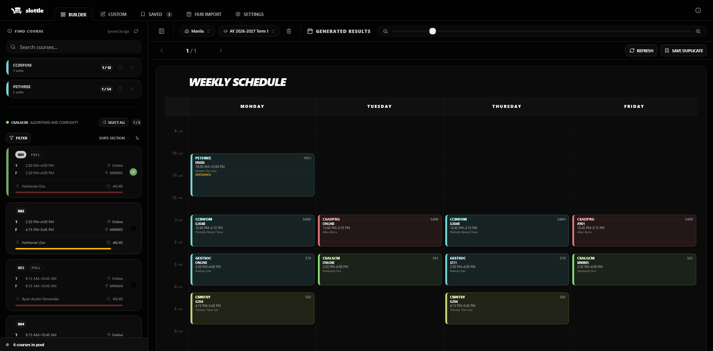
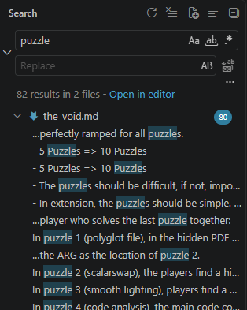

# Technical Rationale

This file is to document the rationale between design and architectural decisions.

## UI Design Inspirations

### Slottle

    

[Slottle](https://pana.tools/slottle-chrome)'s overall layout is clean, effective, and makes sense to a normal user. As such, the layout and design of Slottle shall become the base (or the fork in version control terms) of the layout and design of Schedkip. However, information and individual components (specifically the course list) could be more condensed or tighter.

### Visual Studio Code

    

Visual Studio Code's layout and design for search is simple, concise, and self descriptive of the functions of each component. I think that this will be a more effective design for the search than Slottle's design.

## Frameworks, Libraries

For this site, I used Svelte / SvelteKit (web framework), TailwindCSS (CSS framework), and SkeletonUI (component library), as I am most familiar with the usage of all of these technologies.

## Course Data Structure

I explicitly defined the entire structure of the course data in `course-interfaces.ts`, with interface definitions. Instead of a JSON file piped into the TypeScript code, I opted to make the mock data inside TypeScript file `mock-data.ts`, to explicitly ensure type safety during the creation of the mock data (and further input from an admin webpage should this be developed into an actual website).

# Course Data

Using 

# Section Selection

I opted to do the selected section operations (addition, removal, checking of sections) to the individual section component itself, while passing the final list of sections selected back to the main `+page.svelte`. For both decisions, I believe it to be the simpler way in terms of programming. While there may be a way of optimizing this system, my focus and programming style is to keep it simple in logic.

# Schedule Building

On original read of the instructions, I went with using flexboxes to create the schedule, and aligning it to 15-minute intervals (effectively rows) with `flex-basis`. Flex is more familiar to me than using grids or tables, and allows simpler control for me to know the flow of each element. I also padded the start and end schedule to the next/nearest hour so that schedules are consistent in layout.